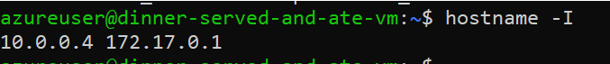
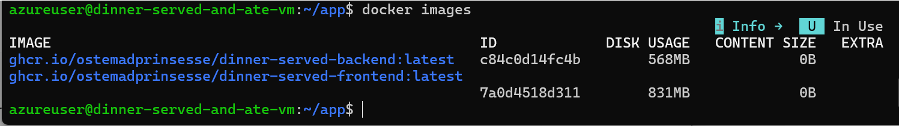

# Diary 6 marts

## What we did
-  We did our presentation, and found out we had issues because our packages were private.
-  Then we started to work on how to set up docker through the online computer.

## A little guide for the future

### Part 1
1. Go to the scripts folder.
2. Follow the two files: Azure-VM-script and TilslutMaskineScript.
3. You should now be logged into Azure.
4. Side node: (We discovered that, some of us had issues trying to use the same $location. With a quick guide from our teacher, we could different locations and it should work just fine, even if we are coding together)

### Part 2
1. Keep the other terminal open, and open a new.
2. Update by updating system packages.
- sudo apt update
- sudo apt upgrade -y
3. Install Docker and Docker compose
- sudo apt install docker.io -y
- sudo apt install docker-compose -y
4. Find Your VM's IP address
-  Private IP (inside the vm): hostname -I

- Public IP (from outside the VM) Open a new terminal outside th VM and run: curl ifconfig.me
5. Log In to Github Container Registry GHCR
- docker login ghcr.io -u YOUR_GITHUB_USERNAME
- When asked for a password, enter your Personal Access Token

### Part 3
1. Pull Our Docker Images
create a folder for the application:
- mkdir app
- cd app
2. Pull the frontend and backend images:
- sudo docker pull ghcr.io/ostemadprinsesse/dinner-served-frontend:latest
- sudo docker pull ghcr.io/ostemadprinsesse/dinner-served-backend:latest

3. sudo docker images
You should now see:
dinner-served-frontend: latest
dinner-served-backend:latest

## Wuhuu! You are now ready to run containers
Once the images are pulled, you can run them using Docker or Docker compose depending on your setup

